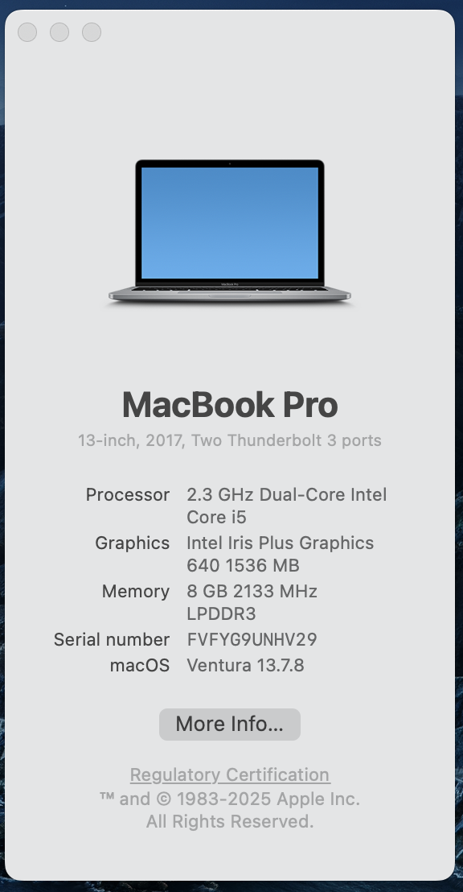
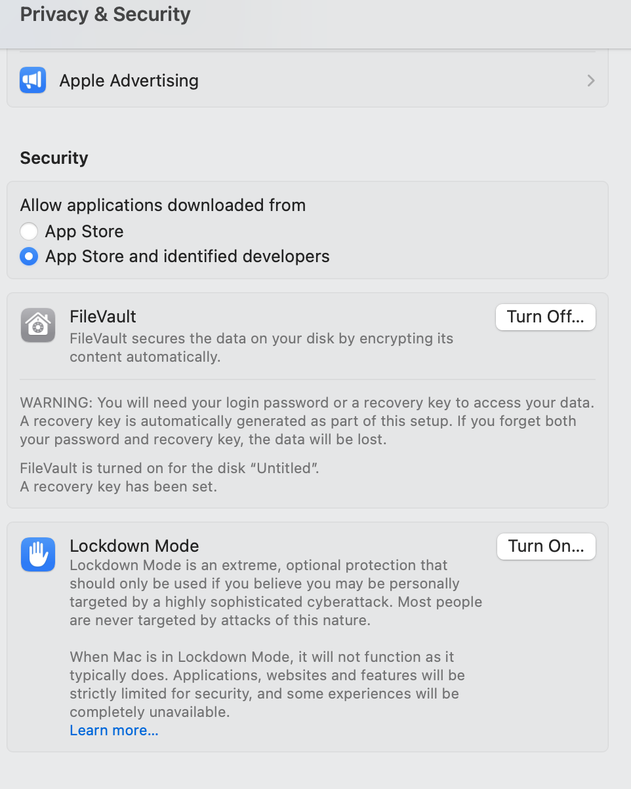
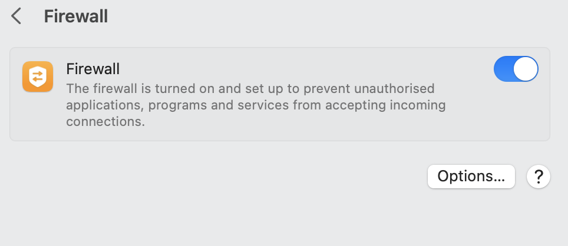

# Device Security Assessment

* **Operating System:** macOS
* **OS Version:** Ventura
* **System Updated:** Yes (updated as of June 2026)
* **Antivirus Installed:** Not required (macOS has built-in security features like XProtect and Gatekeeper)
* **Firewall Enabled:** Yes

# Screenshots

# Screenshots Proof

# System Info (OS Details)

# Antivirus Status

# Firewall Status

---

# Part B: Password Security Review

# What makes a strong password?

A strong password is long and difficult to guess. It should include a combination of uppercase letters, lowercase letters, numbers, and special characters.

# Why should passwords be unique?

Passwords should be unique for each account so that if one password is compromised, other accounts remain safe.

# What is Multi-Factor Authentication (MFA)?

MFA is a security method that requires two or more verification steps, such as a password along with an OTP or biometric verification.

# What are the risks of password reuse?

Reusing passwords increases the risk of multiple accounts being hacked if one password is exposed.

# Password Policy

1. Use at least 12 characters
2. Include both uppercase and lowercase letters
3. Add numbers and special characters
4. Avoid using personal information
5. Enable MFA wherever possible

---

# Part C: Account Security Review

| Platform | MFA Enabled | Strong Password | Recovery Email |
| -------- | ----------- | --------------- | -------------- |
| Google   | Yes         | Yes             | Yes            |
| GitHub   | Yes         | Yes             | Yes            |
| LinkedIn | No          | Yes             | Yes            |

---

# Part D: Cyber Threat Research

# Phishing

Phishing is a cyber attack in which fake emails or websites are used to steal sensitive information.
**Example:** A fake bank email asking for login details.
**Prevention:** Avoid clicking on unknown links and always verify the sender.

# Malware

Malware is harmful software that can damage or steal data from a system.
**Example:** A virus downloaded through cracked or unsafe software.
**Prevention:** Install antivirus software and avoid downloading from unknown sources.

# Ransomware

Ransomware locks files and demands payment to restore access.
**Example:** WannaCry attack.
**Prevention:** Regularly back up data and avoid suspicious files.

# Social Engineering

This attack manipulates people into revealing confidential information.
**Example:** Someone pretending to be technical support.
**Prevention:** Never share personal or sensitive information.

# Data Breach

A data breach is unauthorized access to sensitive information.
**Example:** A company database leak.
**Prevention:** Use strong passwords and follow proper security practices.

---

# Part E: Awareness Poster

* **Topic:** Strong Password Awareness
* **Tool Used:** Canva
* ![Awareness poster] (poster.png)

---

# Part F: Reflection Report

While performing this task, I realized that my digital habits were not completely secure. I found that I sometimes used similar passwords across different accounts, which is a major risk. If one account gets hacked, other accounts using the same password can also be compromised.

I also noticed that Multi-Factor Authentication (MFA) was not enabled on all platforms, making them more vulnerable to unauthorized access. In addition, I was not regularly checking system updates, which can leave security vulnerabilities open.

To improve my security, I will start using strong and unique passwords for every account. I will enable MFA wherever possible and ensure that my system stays updated. I will also be more careful while clicking links and downloading files from unknown sources.

Cybersecurity is very important in today’s digital world because most personal and financial data is stored online. Even a small mistake can lead to serious consequences such as data theft or financial loss. Therefore, it is important to stay aware and follow good security practices.

